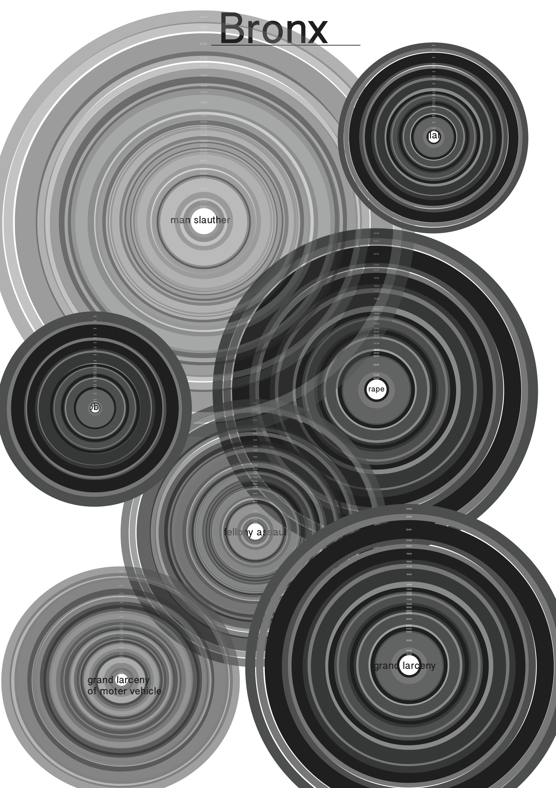
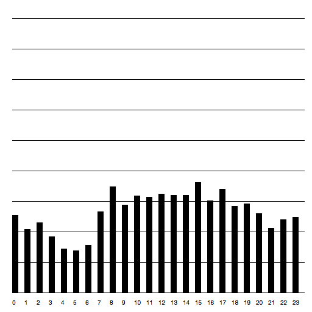
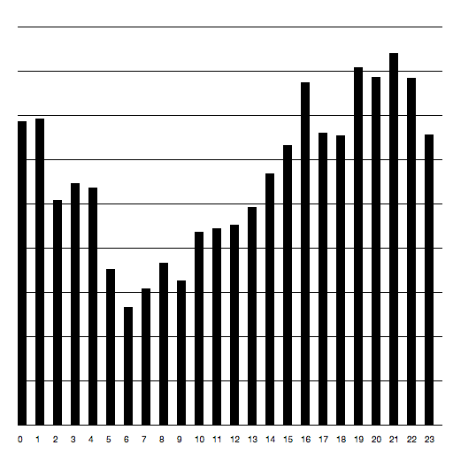
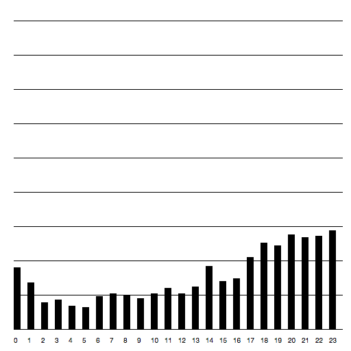
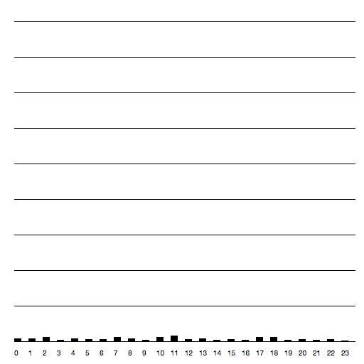
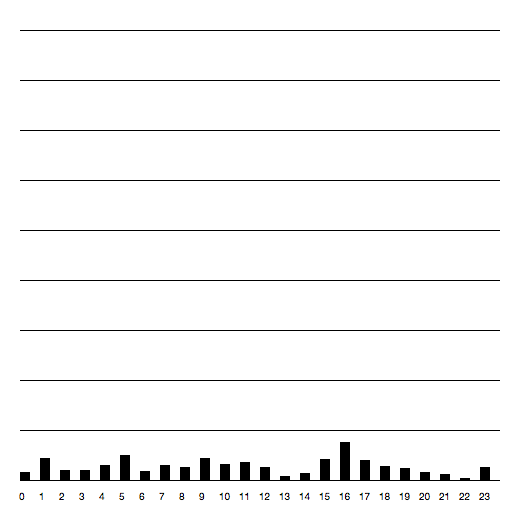
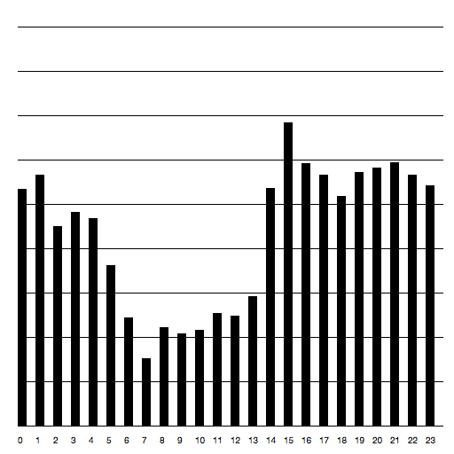
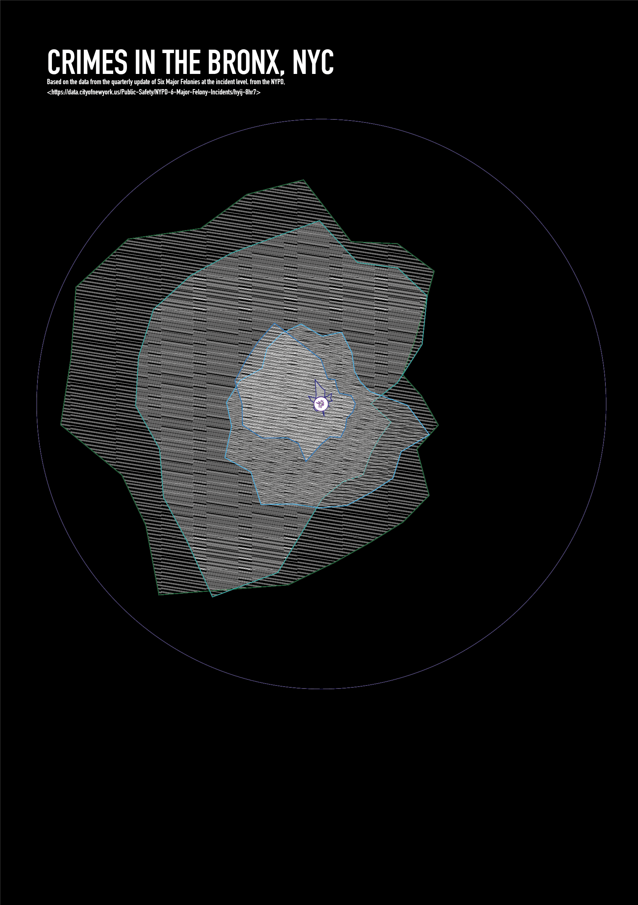
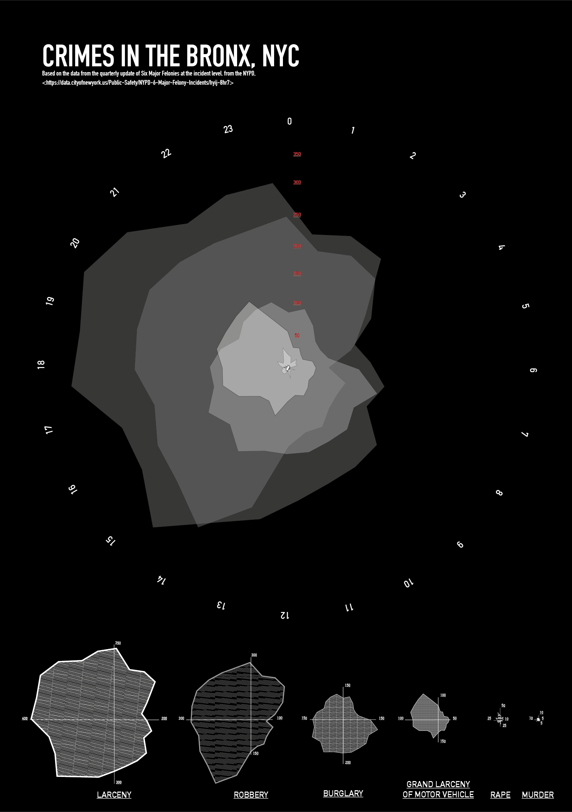
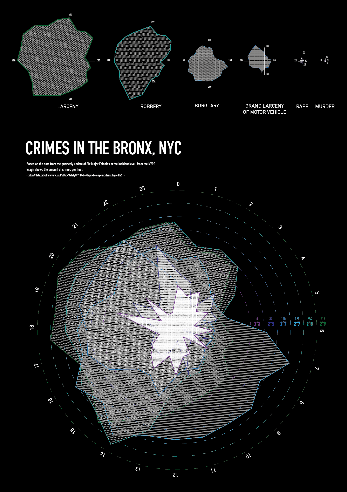

# # New York City Crimes 

## Concept 
I found the data of the Crimes which had occured in NYC interesting from the moment we found them. How cool would is be to show in three poster the difference in amount of crimes! Maybe we would find out what crime is most common in what borough of nyc. 

## Used information

The result of all the scraping of  **the first time** is a JSON file called [Data Bronx](Data/bronx.json). In this file, there's information about: 
	- code of crime (given by NYPD)  
	- Occurence day  
	- Occurence month 
	- Occurence year 
	- Occurence hour 
	- Kind of Offense  
	- Borough (all the Bronx obviously) 
	- Location (expressed in coordinates) 

The result of all the scraping of  **the second time**, after the first iteration is are 6 seperate JSON files called  
[Murder Data] (Data/bronx_MURDER.json). 
[Rape Data] (Data/bronx_RAPE.json).  
[Burglary Data] (Data/bronx_BURGLARY.json). 
[Grand Larceny of Motor Vehicly Data] (Data/bronx_LARCENY.json).  
[Felont Data] (Data/bronx_FELONY.json). 
[Robbery Data] (Data/bronx_ROBBERY.json).  

In these files, there's the same information as in the previous file.

## Own Sketches
The first sketch made was in the beginning of the process. We wanted to show the differences between the crimes in different boroughs. 

Afterwards I made sketches with plotdevice. We already knew a bar graphs wasn't what we wanted, so I didn't really experiment any further with that.  

But later we decided to focus on the hour of occurence, so we needed a different visual representation. In the Library we found a book on data visualization in which a really cool circle graph was. Different layers of rounded cornered shapes. After drawing one shape in illustrator I experimented with the rounded corners,  

But later we realized that coding the rounded corners was too difficult, so I decided to stay put with the existing corners, or else the information wouldn't be completely accurate. 

With the illustrator codes I ended up with 6 different shapes and sizes, which I overlayed fist.  

The difference however between the amount of the larceny and that of murder was so big that when portrayed on true size, the murder was very difficult to see. The amount wasn't good to read anymore. That why I added, smaller underneath the big graph, the smaller graphs with the highest point on that graph in numers. ()I didn't realy really the bargraphs which is why I only used the new shapes.) 

I wasn't really content witht he big graph, so I figured out a way to show all the shapes in the same graphs using a logaritm. The logarithm of 2 was fitting the best, so I used 2^3 for the smallest, and 2^9 for the biggest. 

