# CELL TOWERS 

### in the Netherlands

### JSON file
The json file that I used, contains of the following information:

-	city - Location
- 	type - Type celltower
-	coordinates_la - lattitude
-	coordinates_lo - longitude
-	x - x position
-	y - y position
-	ant_height - the height of the antenna
	
For my code I used the location, the coordinates lattidude and longtitude and the x and y position. 

Here I will put a link that will direct you to the JSON file: https://github.com/ArtezGDA/MappingTheCity-Data/tree/master/Celltowers

### Idea

For my data poster I wanted to show the accumulation of the celltowers in the Netherlands because there are so many. So I started to played with the transparency of the dots that represent the celltowers.

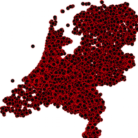

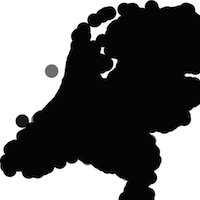

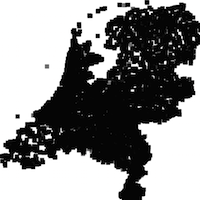

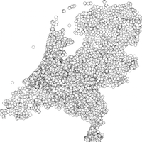
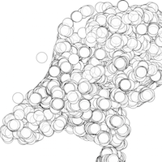
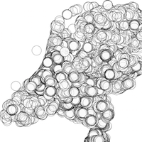
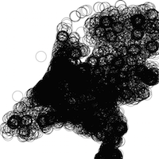
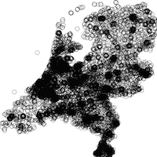
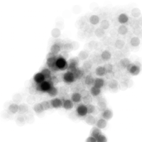
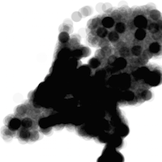

But in these sketches you can see that it became really hard to distinguish the dots. So I thought about seperating the different information in mutiple poster.

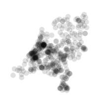
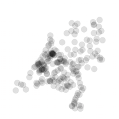
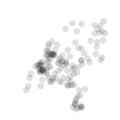
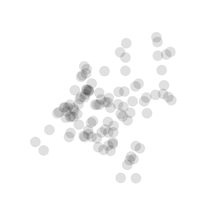
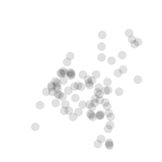
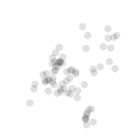
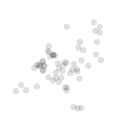
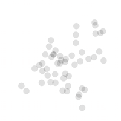
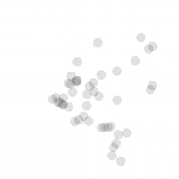

After my these sketches it became clear to me that the best way to represent all the celltowers was to make a heat map.Because then you would see how many there actually are.
 
 
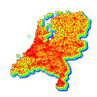 
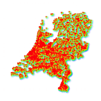 
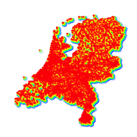 
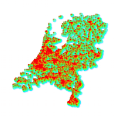 
 

### The final poster

I kept the final poster really simple. I made a few iterations, but in the end decided to stay with a normal heat map.

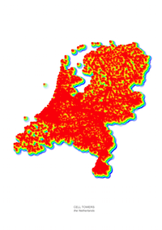 
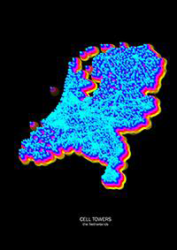

And this is my final poster:

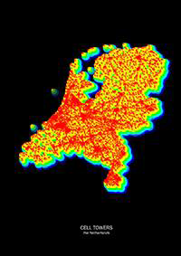

### Code

[code](heatmap.pv)

###License (MIT License)

Apeace Leaflet is released under the MIT license.

Copyright © 2016 Jeanine van Berkel.

Permission is hereby granted, free of charge, to any person obtaining a copy of this software and associated documentation files (the “Software”), to deal in the Software without restriction, including without limitation the rights to use, copy, modify, merge, publish, distribute, sublicense, and/or sell copies of the Software, and to permit persons to whom the Software is furnished to do so, subject to the following conditions:

The above copyright notice and this permission notice shall be included in all copies or substantial portions of the Software.

THE SOFTWARE IS PROVIDED “AS IS”, WITHOUT WARRANTY OF ANY KIND, EXPRESS OR IMPLIED, INCLUDING BUT NOT LIMITED TO THE WARRANTIES OF MERCHANTABILITY, FITNESS FOR A PARTICULAR PURPOSE AND NONINFRINGEMENT. IN NO EVENT SHALL THE AUTHORS OR COPYRIGHT HOLDERS BE LIABLE FOR ANY CLAIM, DAMAGES OR OTHER LIABILITY, WHETHER IN AN ACTION OF CONTRACT, TORT OR OTHERWISE, ARISING FROM, OUT OF OR IN CONNECTION WITH THE SOFTWARE OR THE USE OR OTHER DEALINGS IN THE SOFTWARE. 
