# Floating screens

## concept

I am interested in the need of screens nowadays. People are really focused on their mobile phones. There is a big fear of having no coverage and being not online. 
To get all “addicts” satisfied there need to be a lot of cell towers that produce and spread the signal. In my info graphic you can see the amount of cell towers per region. 


##sketches
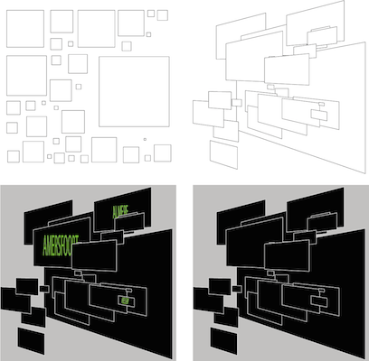


##iteration 1

A code which draws a square on a random place. 

##iteration 2

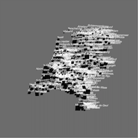
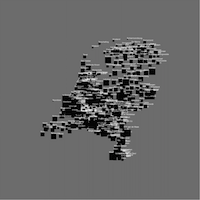
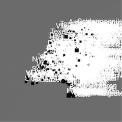
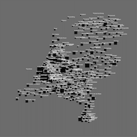

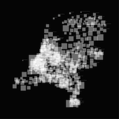
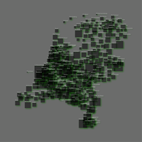
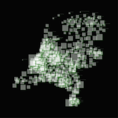
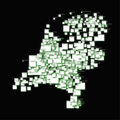
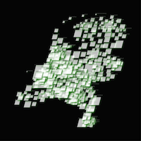
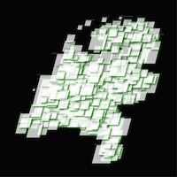
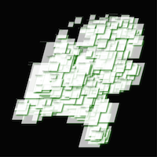
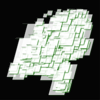

##iteration 3

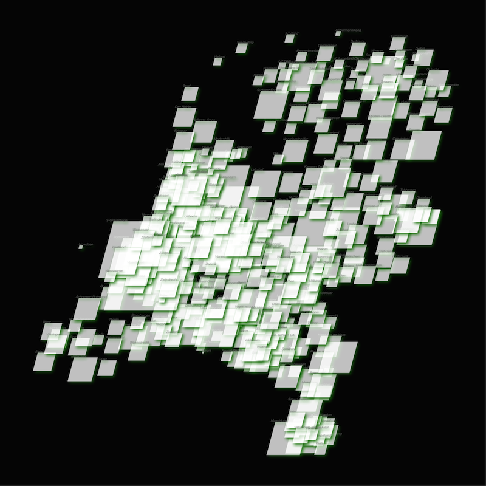

