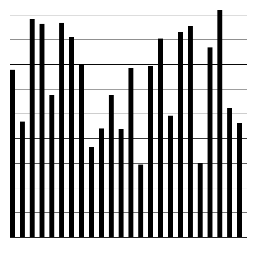

#brooklyn ny data poster

#iteration 1

We found date from: new york city data, in the data where all the assautls in new york from allot of years writtin down. 
We scraped the date into jaso files but the file was way to big so we filterd it to the hours and crimes. 

With knowing that we wanted to do something with the hours and crimes i made this first iteration of how i wanted my poster to look. 

#iteration 2

Than we started to scrap more and with plot divice we came to the next bargraphs:

this wasnt good because the data is not clear enough to read and not easy to understand. It was to vage. 

bulglary

fellonyassault

motoverhicle

murder

rape

robbery

#iteration 3

Now we made the data more clear to have the time included from 12 (0) a clock till 23

bulglary

fellonyassault

motoverhicle

murder

rape

robbery

#iteration 4

The bargraphs that i now had i found still not clear enough. It wasnt what i wanted. The next step was illustrator codering. 

This was the result:

brooklyn burglary

brooklyn fellonyassault

brooklyn motor vehicle

brooklyn murder

brooklyn rape

brooklyn robbery


#iteration 5


THE FINAL POSTER!




##### Design Work for the Mapping the City assignment

This repository will hold the individual design work for the [Mapping the City](https://github.com/ArtezGDA/Course-Material/blob/master/MappingTheCity.md) assignment.

The repository is still empty, but will soon contain a folder per each student.
