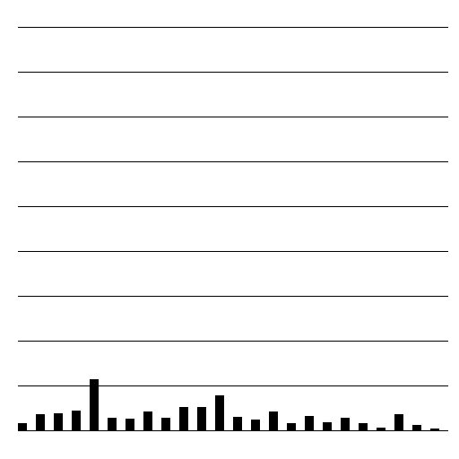

#brooklyn ny data poster

#iteration 1

#iteration 2

this wasnt good because the data is not clear enough to read and not easy to understand. It was to vage. 

bulglary

fellonyassault

motoverhicle

murder

rape

robbery

#iteration 3

Now we made the data more clear to have the time included from 12 (0) a clock till 23

bulglary

fellonyassault

motoverhicle

murder

rape

robbery

#iteration 4

brooklyn_burglary.ai
brooklyn_fellonyassault.ai
brooklyn_motervehicle.ai
brooklyn_murder.ai
brooklyn_rape.ai
brooklyn_robbery.ai


#iteration 5


THE FINAL POSTER!

##### Design Work for the Mapping the City assignment

This repository will hold the individual design work for the [Mapping the City](https://github.com/ArtezGDA/Course-Material/blob/master/MappingTheCity.md) assignment.

The repository is still empty, but will soon contain a folder per each student.
