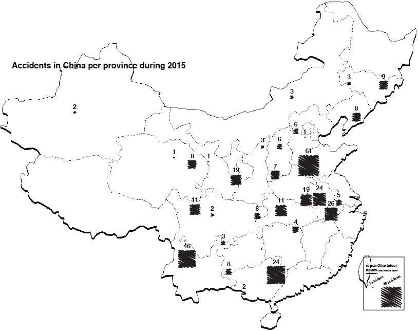
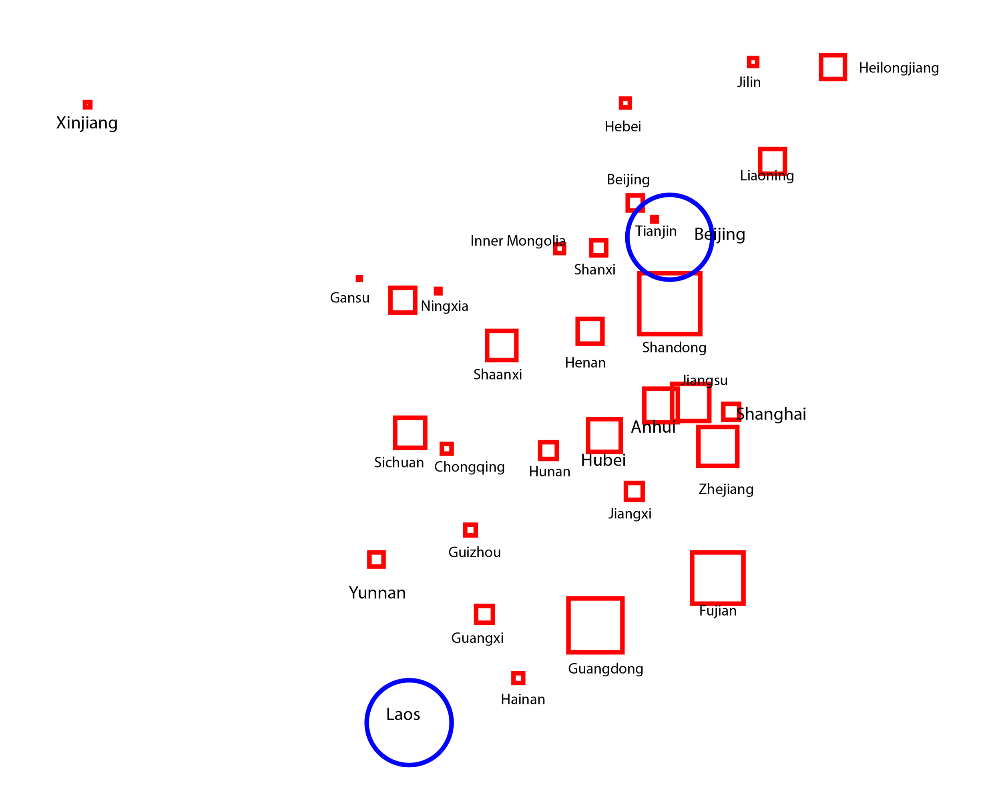
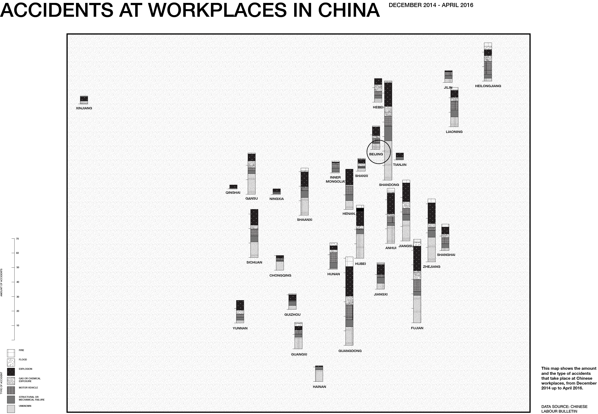

# Accident Map Chinese Workplaces

## concept

With the data we got from the China Labour Bulletin, we could make different graphs with the following input: 
1. Province
2. Industry
3. Type of Accident
4. Number of employees
5. Number of deaths
6. Number of injuries
7. Number of person punished

But the last 4 categories where missing a lot of data, so we considered them useless. With the first 3 categories we created 3 different posters.

I chose the type of accident, because for me it's the most interesting part of the map. There are regions with other trends in the type of accident than other regions.

##SKETCHES AND CODED EXAMPLES

##FINAL DATAPOSTER

