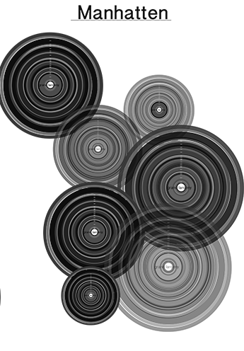
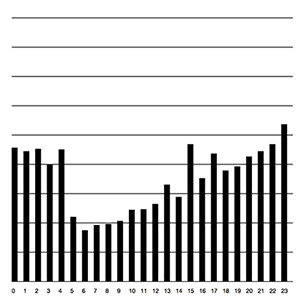
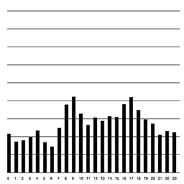
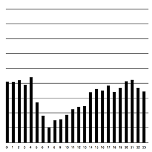
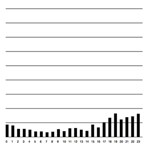
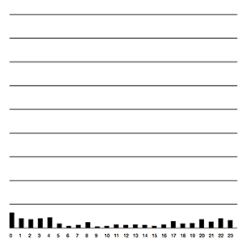
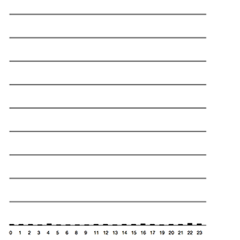
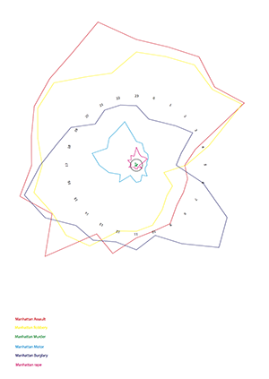
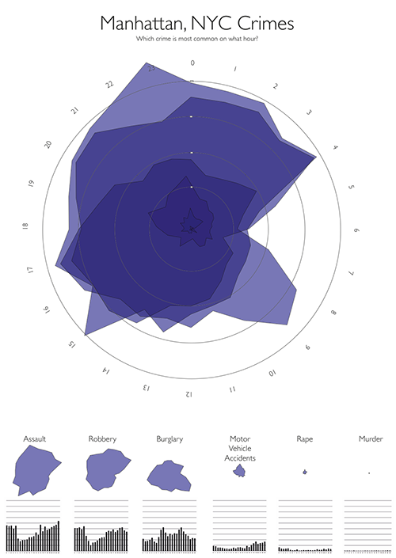

# Mapping the City - Maps

##### Design Work for the Mapping the City assignment

This repository will hold the individual design work for the [Mapping the City](https://github.com/ArtezGDA/Course-Material/blob/master/MappingTheCity.md) assignment.
  

##1st itteration
 A sketch for a poster based on witch crime is most common on what hour. The bigger the cickle, more crimes are committed at that time.   

  

  
##2end itteration
 We continued with the idea of the crimes most common on what hour. So I made a bar graph which indicates what crime is committed the most and less.
  
####Assault
  
####Burglary
  
####Robbery
  
####Motor Vehicle Accidents
  
####Rape
  
####Murder
  

##3ed itteration
 The process of putting the data we had in an illustrator file and run it with a script. eventualy it worked and differend shapes came out of it. This is a raw sketch to see the overall vieuw. 

##4ed itteration
 Final Poster

