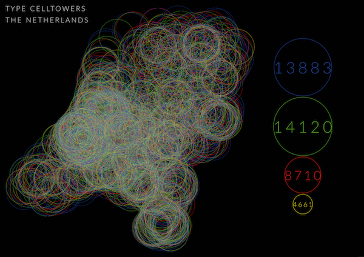
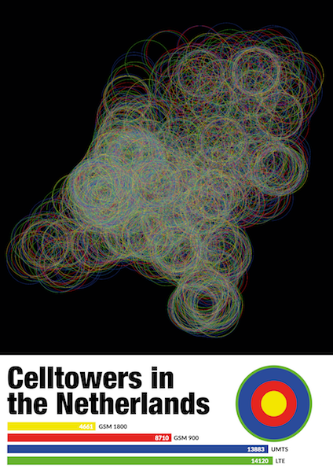

# Type of Celltowers

## Concept
I was wondering is people are aware of how many celltowers there actually are around them? This project is based on the Netherlands. I wanted to make an overview of all the celltowers and their place and what kind of type celltower it was. 

##Sketches

The first sketch was meant to see what happened with a thin line.

A thicker line.

Change of color.

Spreading and size.

More matching colors.

Smaller dots.

Bigger with opacity.

Less opacity.

More opacity.

How will it work with a white background.

Back to black.

Final test

- [towers OnMap](plotdevice/towers OnMap.pv)
- [towers OnMap color](plotdevice/towers OnMap color.pv)
- [towers OnMap-2](plotdevice/towers OnMap-2.pv)
- [towers OnMap-2_fatter](plotdevice/towers OnMap-2_fatter.pv)
- [towers OnMap-3](plotdevice/towers OnMap-3.pv)
- [towers OnMap-4](plotdevice/towers OnMap-4.pv)
- [towers OnMap-5](plotdevice/towers OnMap-5.pv)
- [towers OnMap-6](plotdevice/towers OnMap-6.pv)
- [towers OnMap-7](plotdevice/towers OnMap-7.pv)
- [towers OnMap-8](plotdevice/towers OnMap-8.pv)
- [towers OnMap-9](plotdevice/towers OnMap-9.pv)
- [towers OnMap-10](plotdevice/towers OnMap-10.pv)
- [towers OnMap-11](plotdevice/towers OnMap-11.pv)
- [towers OnMap-12](plotdevice/towers OnMap-12.pv)
- [towers OnMap-13](plotdevice/towers OnMap-13.pv)
- [towers OnMap-14](plotdevice/towers OnMap-14.pv)
- [towers OnMap-15](plotdevice/towers OnMap-15.pv)

##Poster-sketches
I wanted to show in strong visual way what the placement of all these celltowers are. So you have a nice overview where and which type of celltower. 

There also a little data on how many data there is collected and a diagram of the comparison in quantity.

###The MIT License (MIT)

Copyright (c) 2016 Graphic Design Arnhem at ArtEZ Academy

Permission is hereby granted, free of charge, to any person obtaining a copy
of this software and associated documentation files (the "Software"), to deal
in the Software without restriction, including without limitation the rights
to use, copy, modify, merge, publish, distribute, sublicense, and/or sell
copies of the Software, and to permit persons to whom the Software is
furnished to do so, subject to the following conditions:

The above copyright notice and this permission notice shall be included in all
copies or substantial portions of the Software.

THE SOFTWARE IS PROVIDED "AS IS", WITHOUT WARRANTY OF ANY KIND, EXPRESS OR
IMPLIED, INCLUDING BUT NOT LIMITED TO THE WARRANTIES OF MERCHANTABILITY,
FITNESS FOR A PARTICULAR PURPOSE AND NONINFRINGEMENT. IN NO EVENT SHALL THE
AUTHORS OR COPYRIGHT HOLDERS BE LIABLE FOR ANY CLAIM, DAMAGES OR OTHER
LIABILITY, WHETHER IN AN ACTION OF CONTRACT, TORT OR OTHERWISE, ARISING FROM,
OUT OF OR IN CONNECTION WITH THE SOFTWARE OR THE USE OR OTHER DEALINGS IN THE
SOFTWARE.